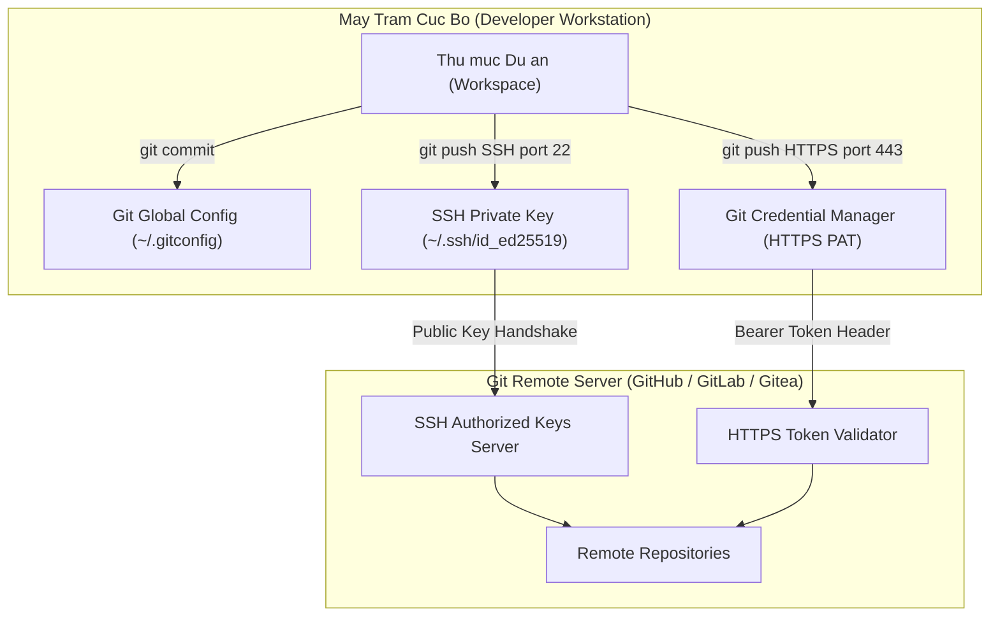

# HUONG DAN CAU HINH WORKSPACE CUC BO VA TAI KHOAN GIT SSH/HTTPS

## 1. Tong quan ve Kien truc Workspace va Git Authentication

Moi truong lam viec (Workspace) chuan hoa la nen tang de dam bao toan bo cac thanh vien trong doi ngu phat trien (Squad) va cac he thong tu dong hoa (CI/CD Pipeline) hoat dong dong nhat. Tai lieu nay huong dan quy trinh thiet lap moi truong phat trien cuc bo, cau hinh danh tinh tac gia tren Git, thiet lap xac thuc an toan thong qua SSH Key (Ed25519) va Personal Access Token (HTTPS), cung nhu ap dung cac tieu chuan Git Workflow nghiem ngat.

### So do Kien truc Ket noi Git (Mermaid)



### So do Luong Xac thuc (ASCII Diagram)

```
+-----------------------------------------------------------------------+
|                       DEVELOPER WORKSTATION                           |
|                                                                       |
|   +-----------------------+            +--------------------------+   |
|   |  ~/.gitconfig         |            |  ~/.ssh/config           |   |
|   |  - user.name          |            |  - Host github.com       |   |
|   |  - user.email         |            |  - IdentityFile          |   |
|   +-----------------------+            +--------------------------+   |
|               |                                     |                 |
+---------------|-------------------------------------|-----------------+
                |                                     |
    [ HTTPS Token Auth ]                     [ SSH Key Exchange ]
     (Port 443 via TLS)                       (Port 22 via SSH-2)
                |                                     |
                v                                     v
+-----------------------------------------------------------------------+
|                         REMOTE GIT SERVER                             |
|                                                                       |
|   +-----------------------+            +--------------------------+   |
|   |  Personal Access Token|            |  SSH Public Key Registry |   |
|   |  (Fine-grained scopes)|            |  (id_ed25519.pub)        |   |
|   +-----------------------+            +--------------------------+   |
|               \                                     /                 |
|                \                                   /                  |
|                 v                                 v                   |
|              +---------------------------------------+                |
|              |     Repository Access & Permissions   |                |
|              +---------------------------------------+                |
+-----------------------------------------------------------------------+
```

---

## 2. Yeu cau He thong va Cong cu Tien quyet

Truoc khi bat dau, dam bao may tram cuc bo da duoc cai dat day du cac cong cu sau:

- Git Client: Phien ban >= 2.38.0
- OpenSSH Client: San co tren Linux, macOS va Windows 10/11 (qua OpenSSH Feature)
- Node.js LTS: Phien ban >= 18.x (neu lam viec voi du an TypeScript/Next.js)
- Trinh quan ly package: npm / pnpm / yarn

Kiem tra phien ban da cai dat trong Terminal:

```bash
git --version
ssh -V
node --version
npm --version
```

---

## 3. Cau hinh Git Global Config

Thiet lap danh tinh tac gia mac dinh cho moi commit duoc tao ra tren may tram.

```bash
# Cau hinh Ten va Email tac gia
git config --global user.name "Nguyen Van A"
git config --global user.email "nguyenvana@company.internal"

# Cau hinh nhanh mac dinh la main
git config --global init.defaultBranch main

# Cau hinh xu ly ky tu xuong dong (CRLF tren Windows, LF tren Linux/macOS)
# Danh cho Windows:
git config --global core.autocrlf true
# Danh cho Linux/macOS:
# git config --global core.autocrlf input

# Cau hinh trinh soan thao mac dinh (VS Code / Vim / Nano)
git config --global core.editor "code --wait"

# Kich hoat tu dong doi mau terminal
git config --global color.ui auto

# Thiet lap co che Rebase mac dinh khi pull
git config --global pull.rebase true
```

Kiem tra lai toan bo cau hinh da luu:

```bash
git config --global --list
```

---

## 4. Huong dan Tao va Cau hinh SSH Key (Ed25519 / RSA)

Khuyen nghi su dung thuat toan **Ed25519** vi do bao mat cao hon va toc do tinh toan vuot troi so voi RSA truyen thong.

### Buoc 4.1: Sinh cap khoa SSH moi

Mo Terminal va thuc hien lenh sau (thay the email cua ban):

```bash
ssh-keygen -t ed25519 -C "nguyenvana@company.internal" -f ~/.ssh/id_ed25519
```

*Luu y: Khi he thong hoi `Enter passphrase`, nhap mat khau bao ve khoa bi mat (private key) de tang cuong bao mat.*

Truong hop he thong cu khong ho tro Ed25519, su dung RSA 4096-bit:

```bash
ssh-keygen -t rsa -b 4096 -C "nguyenvana@company.internal" -f ~/.ssh/id_rsa_company
```

### Buoc 4.2: Khoi dong SSH Agent va them khoa

Tren Linux / macOS / Git Bash:

```bash
eval "$(ssh-agent -s)"
ssh-add ~/.ssh/id_ed25519
```

Tren Windows PowerShell (chay voi quyen Administrator neu service chua bat):

```powershell
Get-Service -Name ssh-agent | Set-Service -StartupType Manual
Start-Service ssh-agent
ssh-add $HOME\.ssh\id_ed25519
```

### Buoc 4.3: Cau hinh tap tin `~/.ssh/config`

Tao hoac chinh sua tap tin `~/.ssh/config` de quan ly ket noi ro rang:

```sshconfig
Host github.com
    HostName github.com
    User git
    IdentityFile ~/.ssh/id_ed25519
    IdentitiesOnly yes
    ServerAliveInterval 60

Host gitlab.internal.company.com
    HostName gitlab.internal.company.com
    User git
    Port 22
    IdentityFile ~/.ssh/id_ed25519
    IdentitiesOnly yes
```

Phan quyen tap tin bao mat (Linux/macOS):

```bash
chmod 700 ~/.ssh
chmod 600 ~/.ssh/id_ed25519
chmod 644 ~/.ssh/id_ed25519.pub
chmod 600 ~/.ssh/config
```

### Buoc 4.4: Sao chep Public Key va them vao Git Server

Lay noi dung Public Key:

```bash
cat ~/.ssh/id_ed25519.pub
```

Sao chep toan bo chuoi ky tu (bat dau bang `ssh-ed25519 AAAAC3...`), truy cap vao muc **Settings -> SSH and GPG Keys** tren GitHub/GitLab va dan vao o **Key Content**.

### Buoc 4.5: Kiem tra ket noi SSH

```bash
ssh -T git@github.com
```

Ket qua mong doi:
```
Hi username! You've successfully authenticated, but GitHub does not provide shell access.
```

---

## 5. Huong dan Cau hinh Git HTTPS voi Personal Access Token (PAT)

Neu don vi cua ban su dung ket noi HTTPS bat buoc qua Proxy hoac Firewall han che Port 22 SSH:

### Buoc 5.1: Tao Personal Access Token tren Git Server
1. Truy cap **Settings -> Developer settings -> Personal access tokens**.
2. Chon **Fine-grained tokens** hoac **Tokens (classic)**.
3. Chon quyen han (Scopes): `repo` (Full control of private repositories), `read:org`, `workflow`.
4. Sao chep Token (dang chuoi `ghp_xxxxxxxxxxxxxxxxxxxx`).

### Buoc 5.2: Cau hinh Git Credential Helper de luu tru Token

Tren Windows:
```bash
git config --global credential.helper manager
```

Tren macOS:
```bash
git config --global credential.helper osxkeychain
```

Tren Linux:
```bash
git config --global credential.helper cache --timeout=36000
# Hoac su dung libsecret:
# git config --global credential.helper /usr/share/doc/git/contrib/credential/libsecret/git-credential-libsecret
```

Khi thuc hien lenh `git clone` hoac `git push` qua HTTPS lan dau tien, he thong se yeu cau nhap Username va Password. Nhap Username cua ban va dan chuoi Token vao o Password.

---

## 6. Cau hinh Tap tin `.gitignore` Chuan va Git Hooks

Moi Repository can co `.gitignore` de tranh commit nham cac file chua bi mat hoac ma build.

Tap tin mau `.gitignore`:

```gitignore
# Node dependencies
node_modules/
npm-debug.log*
yarn-debug.log*
yarn-error.log*
.pnpm-debug.log*

# Production Build outputs
.next/
out/
build/
dist/

# Environment files containing secrets
.env
.env.local
.env.development.local
.env.test.local
.env.production.local
*.pem
*.key
id_rsa
id_ed25519

# IDE & OS files
.vscode/
.idea/
.DS_Store
Thumbs.db
*.swp
*.swo

# Coverage and Test logs
coverage/
.nyc_output/
*.log
```

### Thiet lap Pre-commit Hook kiem tra Secret

Tao tap tin `.git/hooks/pre-commit` (hoac dung Husky):

```bash
#!/bin/sh
# Kiem tra file bi mat vo tinh duoc staged
FILES=$(git diff --cached --name-only | grep -E '\.(env|pem|key)$')

if [ -n "$FILES" ]; then
    echo "[ERROR] Phat hien tap tin chua bi mat dang trong danh sach staged:"
    echo "$FILES"
    echo "Huy commit! Vui long go bo khoi git truoc khi commit."
    exit 1
fi

exit 0
```

Cap quyen thuc thi:

```bash
chmod +x .git/hooks/pre-commit
```

---

## 7. Quy chuan Git Workflow va Dat ten Nhanh (Branching Strategy)

Doi ngu ap dung mo hinh **Trunk-Based Development** ket hop **Feature Branching**:

### Quy tac Dat ten Nhanh (Branch Naming Convention)
- `feature/<task-id>-<short-description>`: Phat trien tinh nang moi (vi du: `feature/PROJ-101-auth-jwt`)
- `bugfix/<task-id>-<short-description>`: Sua loi thong thuong (vi du: `bugfix/PROJ-204-fix-redirect`)
- `hotfix/<short-description>`: Sua loi khancap tren Production (vi du: `hotfix/patch-cve-trivy`)
- `release/vX.Y.Z`: Nhanh chuan bi dong goi phat hanh

### Quy trinh lam viec tung buoc

```bash
# 1. Cap nhat nhanh main moi nhat
git checkout main
git pull origin main

# 2. Tao nhanh lam viec moi
git checkout -b feature/PROJ-101-auth-jwt

# 3. Thuc hien code va commit theo chuan Conventional Commits
git add .
git commit -m "feat(auth): implement JWT token rotation and cookie session"

# 4. Dong bo lai voi main truoc khi day len Remote
git fetch origin main
git rebase origin/main

# 5. Day nhanh len Remote Repository
git push -u origin feature/PROJ-101-auth-jwt
```

---

## 8. Kiem thu Ket noi va Xu ly Su co Thuong gap (Troubleshooting)

### Su co 1: `Permission denied (publickey)`
- **Nguyen nhan**: SSH Key chua duoc them vao SSH Agent, sai duong dan IdentityFile, hoac Public Key chua duoc cap nhat tren Git Server.
- **Cach khac phuc**:
  ```bash
  # Chay SSH o che do Verbose de debug
  ssh -vT git@github.com
  # Kiem tra xem key da load vao agent chua
  ssh-add -l
  # Neu chua co, them key vao
  ssh-add ~/.ssh/id_ed25519
  ```

### Su co 2: `Host key verification failed`
- **Nguyen nhan**: Fingerprint cua Git Server thay doi hoac chua duoc ghi nhan vao `known_hosts`.
- **Cach khac phuc**:
  ```bash
  ssh-keyscan -t ed25519 github.com >> ~/.ssh/known_hosts
  ```

### Su co 3: Git bi vuong merge conflict trong qua trinh Rebase
- **Cach khac phuc**:
  ```bash
  # Xem cac file bi xung dot
  git status
  # Sau khi mo editor sua xong cac xung dot:
  git add <file-da-sua>
  # Tiep tuc rebase
  git rebase --continue
  # Neu muon huy rebase quay ve trang thai ban dau
  # git rebase --abort
  ```

---
*Tai lieu duoc bien soan boi Docs & Knowledge Author Squad.*
