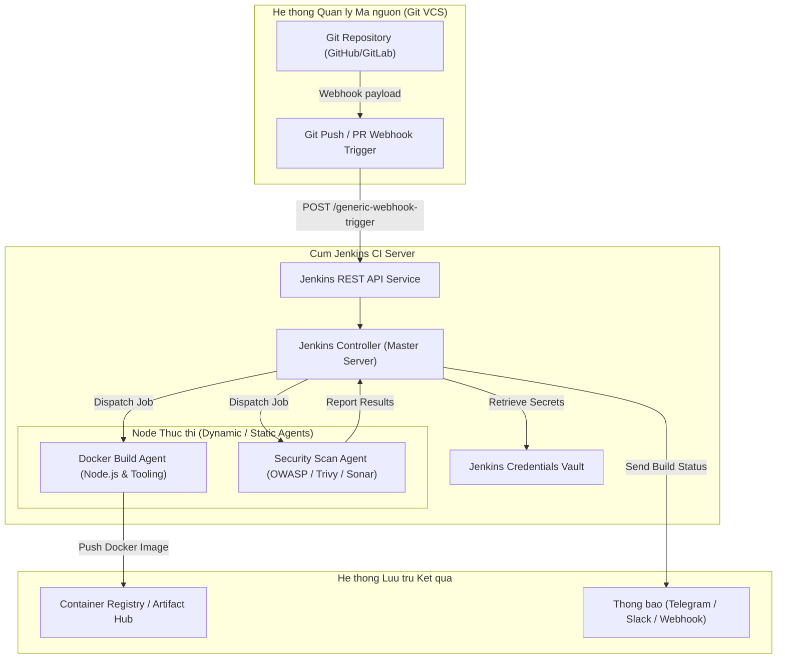

# HUONG DAN CAI DAT JENKINS CI SERVER, TAO API TOKEN VA PIPELINE MASTER JOB

## 1. Tong quan Kien truc Jenkins Controller va Agent

Jenkins la nen tang tu dong hoa ma nguon mo hang dau trong quy trinh Continuous Integration & Continuous Delivery (CI/CD). Kien truc tieu chuan su dung mo hinh Controller-Agent (truoc day la Master-Slave), trong do Controller chiu trach nhiem dieu phoi, quan ly giao dien, luu tru lich su build va luu tru tap tin bi mat (Credentials). Cac tac vu build nang nhu bien dich ma nguon, kiem thu don vi, quet bao mat va dong goi Docker image duoc phan bo toi cac Agent thuc thi.

### So do Kien truc Jenkins CI System (Mermaid)



### So do Pipeline Execution Flow (ASCII Diagram)

```
+-----------------------------------------------------------------------+
|                    JENKINS PIPELINE EXECUTION FLOW                    |
|                                                                       |
|   +-------------------+       +-------------------+                   |
|   |  Stage 1: Checkout| ----> |  Stage 2: Install |                   |
|   |  - Git Clone      |       |  - npm ci         |                   |
|   |  - Branch Checkout|       |  - Cache packages |                   |
|   +-------------------+       +-------------------+                   |
|                                         |                             |
|                                         v                             |
|   +-------------------+       +-------------------+                   |
|   |  Stage 4: Unit/QA | <---- |  Stage 3: Lint    |                   |
|   |  - Jest / Vitest  |       |  - ESLint         |                   |
|   |  - Coverage Test  |       |  - TypeScript tsc |                   |
|   +-------------------+       +-------------------+                   |
|             |                                                         |
|             v                                                         |
|   +-------------------+       +-------------------+                   |
|   |  Stage 5: Security| ----> |  Stage 6: Build   |                   |
|   |  - SonarQube      |       |  - Docker BuildKit|                   |
|   |  - Trivy / OWASP  |       |  - Push Registry  |                   |
|   +-------------------+       +-------------------+                   |
|                                         |                             |
|                                         v                             |
|                               +-------------------+                   |
|                               |  Stage 7: Notify  |                   |
|                               |  - Webhook Alert  |                   |
|                               |  - Post-build log |                   |
|                               +-------------------+                   |
+-----------------------------------------------------------------------+
```

---

## 2. Trien khai Jenkins Server bang Docker Compose

Khuyen nghi trien khai Jenkins Controller thong qua Docker de de dang sao luu va nang cap phien ban.

### Buoc 2.1: Chuan bi tap tin `docker-compose.yml`

Tao thu muc va tap tin `docker-compose.yml`:

```yaml
version: '3.8'

networks:
  ci-network:
    driver: bridge

volumes:
  jenkins_home:
    driver: local

services:
  jenkins:
    image: jenkins/jenkins:lts-jdk17
    container_name: jenkins-ci-controller
    restart: unless-stopped
    privileged: true
    user: root
    ports:
      - "8080:8080"
      - "50000:50000"
    environment:
      - JAVA_OPTS=-Djenkins.install.runSetupWizard=true -Xmx2048m -Xms1024m -Duser.timezone=Asia/Ho_Chi_Minh
    volumes:
      - jenkins_home:/var/jenkins_home
      - /var/run/docker.sock:/var/run/docker.sock
      - /usr/bin/docker:/usr/bin/docker
    networks:
      - ci-network
```

### Buoc 2.2: Khoi dong dich vu Jenkins

```bash
# Tao va khoi chay container o che do detached
docker compose up -d

# Xem log de lay Initial Admin Password
docker logs -f jenkins-ci-controller
```

Tim dong chuoi mat khau 32 ky tu:
```
*************************************************************
Jenkins initial setup is required. An admin user has been created.
Please use the following password to proceed to installation:

4a82b406e123456789abcdef01234567

This may also be found at: /var/jenkins_home/secrets/initialAdminPassword
*************************************************************
```

---

## 3. Thiet lap Ban dau va Cai dat Plugins

1. Truy cap trinh duyet tai dia chi `http://<server-ip>:8080`.
2. Nhap mat khau quan tri ban dau da lay o buoc tren.
3. Chon **Install suggested plugins**.
4. Sau khi he thong cai dat xong, truy cap **Manage Jenkins -> Plugins -> Available Plugins** va cai dat them cac plugin bat buoc:
   - **Pipeline: Stage View**
   - **Generic Webhook Trigger Plugin**
   - **Credentials Binding Plugin**
   - **Docker Pipeline**
   - **SonarQube Scanner for Jenkins**
   - **OWASP Dependency-Check Plugin**
   - **Telegram Notification Plugin** (hoac Slack Notification)
5. Khoi dong lai Jenkins sau khi cai dat xong plugin.

---

## 4. Huong dan Tao Jenkins API Token va Quan ly Credentials

API Token cho phep cac script ngoai, CLI hoac Webhook tu GitHub kich hoat Jenkins Pipeline ma khong can truyen mat khau nguoi dung goc.

### Buoc 4.1: Tao User API Token
1. Dang nhap vao Jenkins bang tai khoan quan tri.
2. Click vao ten tai khoan o goc tren ben phai -> Chon **Configure** (hoac **Security**).
3. Tim muc **API Token** -> Click **Add new Token**.
4. Dat ten Token: `automation-pipeline-token`.
5. Click **Generate** va sao chep ma token (vi du: `11a8b92c4389df0340b4908a1c6e1e8392`).

### Buoc 4.2: Them Credentials vao Jenkins Vault
Truy cap **Manage Jenkins -> Credentials -> System -> Global credentials (unrestricted) -> Add Credentials**:

1. **Git Deploy Key (SSH Key)**:
   - Kind: `SSH Username with private key`
   - ID: `git-deploy-key`
   - Username: `git`
   - Private Key: Dan noi dung file `~/.ssh/id_ed25519`
2. **Container Registry Credentials**:
   - Kind: `Username with password`
   - ID: `docker-registry-auth`
   - Username: `registry-service-account`
   - Password: `<registry-token-hoac-password>`
3. **SonarQube Auth Token**:
   - Kind: `Secret text`
   - ID: `sonar-auth-token`
   - Secret: `<sqp_xxxxxxxxxxxxxxxxxxxxxxxxxxxx>`

---

## 5. Xay dung Jenkinsfile Declarative Pipeline Chuan

Tao tap tin `Jenkinsfile` tai thu muc goc cua Repository:

```groovy
pipeline {
    agent any

    options {
        timeout(time: 30, unit: 'MINUTES')
        buildDiscarder(logRotator(numToKeepStr: '20'))
        disableConcurrentBuilds()
        ansiColor('xterm')
    }

    environment {
        PROJECT_NAME       = 'core-workflow-engine'
        DOCKER_REGISTRY    = 'registry.company.internal/production'
        IMAGE_TAG          = "${env.BUILD_NUMBER}-${env.GIT_COMMIT.take(7)}"
        DOCKER_CREDS_ID    = 'docker-registry-auth'
        NODEJS_VERSION     = 'node:18-alpine'
    }

    stages {
        stage('Checkout Source') {
            steps {
                echo "[INFO] Dang clone va kiem tra ma nguon..."
                checkout scm
                script {
                    env.GIT_AUTHOR = sh(script: 'git log -1 --pretty=format:"%an <%ae>"', returnStdout: true).trim()
                    env.COMMIT_MSG = sh(script: 'git log -1 --pretty=format:"%s"', returnStdout: true).trim()
                }
                echo "[INFO] Commit: ${env.COMMIT_MSG} boi ${env.GIT_AUTHOR}"
            }
        }

        stage('Dependency Installation') {
            agent {
                docker {
                    image "${env.NODEJS_VERSION}"
                    reuseNode true
                }
            }
            steps {
                echo "[INFO] Cai dat dependencies qua npm ci..."
                sh '''
                    npm ci --prefer-offline --no-audit
                '''
            }
        }

        stage('Code Quality & Lint') {
            agent {
                docker {
                    image "${env.NODEJS_VERSION}"
                    reuseNode true
                }
            }
            steps {
                echo "[INFO] Chay kiem tra cu phap va type checking..."
                sh '''
                    npx eslint . --max-warnings=0
                    npx tsc --noEmit
                '''
            }
        }

        stage('Unit & Regression Tests') {
            agent {
                docker {
                    image "${env.NODEJS_VERSION}"
                    reuseNode true
                }
            }
            steps {
                echo "[INFO] Thuc thi Unit Tests..."
                sh '''
                    npm test -- --ci --coverage --maxWorkers=2
                '''
            }
            post {
                always {
                    junit testResults: 'reports/**/*.xml', allowEmptyResults: true
                }
            }
        }

        stage('Security Scanning') {
            steps {
                echo "[INFO] Thuc thi kiem tra an ninh ma nguon..."
                script {
                    echo "[INFO] Quet lo hong phu thuoc..."
                }
            }
        }

        stage('Container Build & Push') {
            when {
                branch 'main'
            }
            steps {
                echo "[INFO] Tien hanh dong goi Docker Image voi BuildKit..."
                withCredentials([usernamePassword(credentialsId: env.DOCKER_CREDS_ID, usernameVariable: 'DOCKER_USER', passwordVariable: 'DOCKER_PASS')]) {
                    sh """
                        echo "\$DOCKER_PASS" | docker login ${env.DOCKER_REGISTRY} -u "\$DOCKER_USER" --password-stdin
                        DOCKER_BUILDKIT=1 docker build \
                            --build-arg BUILD_VERSION=${env.IMAGE_TAG} \
                            --tag ${env.DOCKER_REGISTRY}/${env.PROJECT_NAME}:${env.IMAGE_TAG} \
                            --tag ${env.DOCKER_REGISTRY}/${env.PROJECT_NAME}:latest \
                            .
                        docker push ${env.DOCKER_REGISTRY}/${env.PROJECT_NAME}:${env.IMAGE_TAG}
                        docker push ${env.DOCKER_REGISTRY}/${env.PROJECT_NAME}:latest
                        docker logout ${env.DOCKER_REGISTRY}
                    """
                }
            }
        }
    }

    post {
        success {
            echo "[SUCCESS] Pipeline Build #${env.BUILD_NUMBER} hoan tat thanh cong!"
        }
        failure {
            echo "[FAILURE] Pipeline Build #${env.BUILD_NUMBER} gap su co nghiem trong!"
        }
        always {
            cleanWs deleteDirs: true, notFailBuild: true
        }
    }
}
```

---

## 6. Cau hinh Webhook Trigger tu Dong tu Git Server

De Jenkins tu dong chay moi khi co Commit hoac Pull Request:

### Buoc 6.1: Cau hinh Job trong Jenkins
1. Tao New Item -> Dat ten `master-pipeline-job` -> Chon **Pipeline**.
2. Trong muc **Build Triggers**, tich chon **Generic Webhook Trigger**.
3. Thiet lap **Token**: `WEBHOOK_SECRET_KEY_PROD_99`.
4. Trong muc **Pipeline**, chon **Pipeline script from SCM** -> Git -> Nhap Repository URL va chon Credential `git-deploy-key`.

### Buoc 6.2: Cau hinh Webhook tren GitHub / GitLab
1. Vao **Settings -> Webhooks -> Add webhook** tren Git Repository.
2. **Payload URL**: `http://<jenkins-ip>:8080/generic-webhook-trigger/invoke?token=WEBHOOK_SECRET_KEY_PROD_99`
3. **Content type**: `application/json`
4. **Which events**: `Just the push event` va `Pull requests`.

---

## 7. Kiem thu Trigger Pipeline bang Curl

Kiem tra kich hoat job tu xa thong qua API Token:

```bash
JENKINS_USER="admin"
JENKINS_TOKEN="11a8b92c4389df0340b4908a1c6e1e8392"
JENKINS_URL="http://localhost:8080"
JOB_NAME="master-pipeline-job"

# Kich hoat build truc tiep qua REST API
curl -X POST \
  "${JENKINS_URL}/job/${JOB_NAME}/buildWithParameters?token=WEBHOOK_SECRET_KEY_PROD_99" \
  --user "${JENKINS_USER}:${JENKINS_TOKEN}"
```

Kiem tra tien trinh cua Job:

```bash
curl -s "${JENKINS_URL}/job/${JOB_NAME}/lastBuild/api/json" \
  --user "${JENKINS_USER}:${JENKINS_TOKEN}" | jq '.result, .building, .duration'
```

---

## 8. Xu ly Su co Thuong gap (Troubleshooting)

### Su co 1: Docker command not found ben trong Jenkins Container
- **Nguyen nhan**: Jenkins container chua duoc mount Docker binary va socket tu Host.
- **Khac phuc**: Kiem tra lai muc `volumes` trong `docker-compose.yml` phai co `/var/run/docker.sock` va `/usr/bin/docker`. Cap quyen socket tren Host neu bi `Permission Denied`:
  ```bash
  sudo chmod 666 /var/run/docker.sock
  ```

### Su co 2: Out of Memory (OOM) khi bien dich du an lon
- **Nguyen nhan**: Java Heap Size hoac Container Memory limit bi thieu.
- **Khac phuc**: Tang tham so `-Xmx4096m` trong `JAVA_OPTS` va bo sung `deploy.resources.limits.memory: 8G` trong docker-compose.

---
*Tai lieu duoc bien soan boi Docs & Knowledge Author Squad.*
