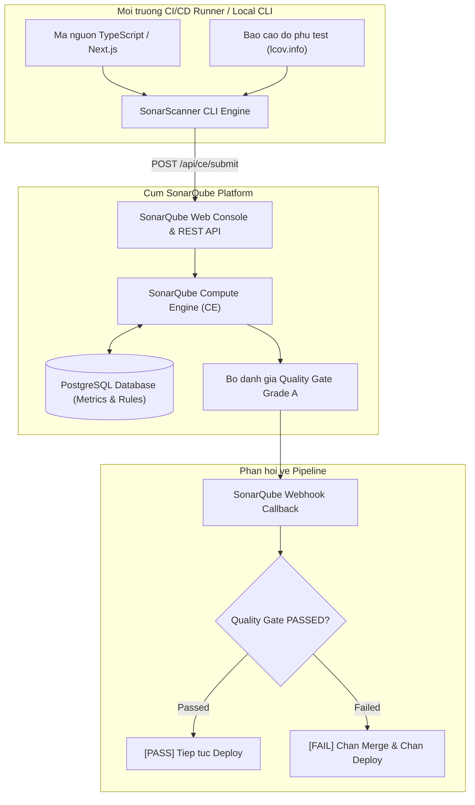

# HUONG DAN CAI DAT SONARQUBE, TAO PROJECT TOKEN VA KICH HOAT QUALITY GATE GRADE A

## 1. Tong quan Kien truc SonarQube va He thong Kiem soat Chat luong Ma nguon

SonarQube la he thong danh gia va quan ly chat luong ma nguon (Clean Code) tu dong thong qua phan tich tinh (Static Application Security Testing - SAST). SonarQube giup phat hien cac loi tiem an (Bugs), lo hong an ninh (Vulnerabilities), doan ma de gay rui ro (Security Hotspots), doan ma trung lap (Duplications) va no ky thuat (Technical Debt).

Mo hinh hoat dong gom hai thanh phan chinh:
1. **SonarQube Server**: Chay he thong quan ly tap trung, luu tru co so du lieu metrics tren PostgreSQL, cung cap UI va tinh toan trang thai Quality Gate.
2. **SonarScanner**: Cong cu dong lenh tich hop vao moi truong Dev cuc bo hoac CI/CD runner de quet ma nguon va day ket qua len Server.

### So do Kien truc Phan tich SonarQube (Mermaid)



### So do Luong Danh gia Quality Gate Grade A (ASCII Diagram)

```
+-----------------------------------------------------------------------+
|                    QUALITY GATE GRADE A CONDITIONS                    |
|                                                                       |
|   +------------------------------------+--------------------------+   |
|   | Metric Criteria                    | Nguong bat buoc (Gate A) |   |
|   +------------------------------------+--------------------------+   |
|   | 1. Code Coverage on New Code       | >= 80.0%                 |   |
|   | 2. Duplicated Lines on New Code    | < 3.0%                   |   |
|   | 3. Maintainability Rating          | Grade A (Debt Ratio <5%) |   |
|   | 4. Reliability Rating              | Grade A (0 New Bugs)     |   |
|   | 5. Security Rating                 | Grade A (0 Vulnerability)|   |
|   | 6. Security Hotspots Reviewed      | 100.0% Reviewed          |   |
|   +------------------------------------+--------------------------+   |
|                                     |                                 |
|                                     v                                 |
|                      +-----------------------------+                  |
|                      |  SonarScanner Analysis      |                  |
|                      +-----------------------------+                  |
|                                     |                                 |
|                                     v                                 |
|                      +-----------------------------+                  |
|                      |  SonarQube Server Gate Eval |                  |
|                      +-----------------------------+                  |
|                                     |                                 |
|                  +------------------+------------------+              |
|                  |                                     |              |
|                  v (Pass Tat ca 6 dieu kien)           v (Vi pham >= 1)|
|      +-----------------------+             +-----------------------+  |
|      | [QUALITY GATE PASSED] |             | [QUALITY GATE FAILED] |  |
|      | Status: OK (Green)    |             | Status: ERROR (Red)   |  |
|      | Approve PR Merge      |             | Block CI/CD Pipeline  |  |
|      +-----------------------+             +-----------------------+  |
+-----------------------------------------------------------------------+
```

---

## 2. Trien khai SonarQube Server va PostgreSQL bang Docker Compose

### Buoc 2.1: Chuan bi tap tin `docker-compose.yml`

Tao thu muc va tap tin `docker-compose.yml`:

```yaml
version: '3.8'

networks:
  sonarnet:
    driver: bridge

volumes:
  sonarqube_data:
  sonarqube_extensions:
  sonarqube_logs:
  postgresql_data:

services:
  sonarqube-db:
    image: postgres:15-alpine
    container_name: sonarqube-postgres
    restart: unless-stopped
    environment:
      POSTGRES_USER: sonar
      POSTGRES_PASSWORD: SonarSecurePassword2026
      POSTGRES_DB: sonarqube
    volumes:
      - postgresql_data:/var/lib/postgresql/data
    networks:
      - sonarnet

  sonarqube:
    image: sonarqube:lts-community
    container_name: sonarqube-server
    restart: unless-stopped
    depends_on:
      - sonarqube-db
    ports:
      - "9000:9000"
    environment:
      - SONAR_JDBC_USERNAME=sonar
      - SONAR_JDBC_PASSWORD=SonarSecurePassword2026
      - SONAR_JDBC_URL=jdbc:postgresql://sonarqube-db:5432/sonarqube
      - SONAR_SEARCH_JAVAADDITIONALOPTS=-Dnode.store.allow_mmap=false
    volumes:
      - sonarqube_data:/opt/sonarqube/data
      - sonarqube_extensions:/opt/sonarqube/extensions
      - sonarqube_logs:/opt/sonarqube/logs
    networks:
      - sonarnet
```

### Buoc 2.2: Cau hinh he thong Linux Host (Bat buoc cho Elasticsearch)

Truoc khi khoi dong SonarQube tren Linux Host:

```bash
# Tang gioi han bo nho ao cho Elasticsearch ben trong SonarQube
sudo sysctl -w vm.max_map_count=524288
sudo sysctl -w fs.file-max=131072
ulimit -n 131072
ulimit -u 8192

# Luu vinh vien vao sysctl.conf
echo "vm.max_map_count=524288" | sudo tee -a /etc/sysctl.conf
sudo sysctl -p
```

Khoi dong cum container:

```bash
docker compose up -d
```

Kiem tra log khi may chu san sang:

```bash
docker logs -f sonarqube-server | grep "SonarQube is operational"
```

---

## 3. Huong dan Tao Project va Sinh Project Token

1. Truy cap giao dien SonarQube tai `http://<server-ip>:9000` (Tai khoan mac dinh: `admin` / `admin`). Thay doi mat khau khi duoc yeu cau.
2. Nhan **Create Project** -> Chon **Manually**.
3. Dien thong tin:
   - **Project display name**: `Core-Workflow-Engine`
   - **Project key**: `core-workflow-engine`
   - **Main branch name**: `main`
4. Chon phuong thuc phan tich **Locally** (hoac **With CI**).
5. Tai muc **Generate a token**:
   - Token name: `sonar_ci_token_prod`
   - Type: `Project Analysis Token`
   - Expires in: `365 days` (hoac `No expiration`)
   - Nhan **Generate** va luu chuoi ma token (vi du: `sqp_9e8d7c6b5a4123456789abcdef01234567890123`).

---

## 4. Thiet lap Quality Gate Grade A Chuan

De dat tieu chuan Clean Code cao nhat (Grade A), thiet lap Quality Gate tuy chinh:

1. Tren thanh dieu huong, vao muc **Quality Gates**.
2. Nhan **Create** -> Dat ten: `Strict Grade A Standards`.
3. Them cac dieu kien (Conditions on New Code & Overall Code):

```
- Coverage on New Code: is less than 80.0% -> ERROR
- Duplicated Lines (%) on New Code: is greater than 3.0% -> ERROR
- Maintainability Rating on New Code: is worse than A -> ERROR
- Reliability Rating on New Code: is worse than A -> ERROR
- Security Rating on New Code: is worse than A -> ERROR
- Security Hotspots Reviewed on New Code: is less than 100.0% -> ERROR
- Critical Issues: is greater than 0 -> ERROR
- Blocker Issues: is greater than 0 -> ERROR
```

4. Nhan **Set as Default** hoac gan rieng cho du an `core-workflow-engine`.

---

## 5. Cau hinh Tap tin `sonar-project.properties`

Tao tap tin `sonar-project.properties` tai thu muc goc cua du an:

```properties
# Dinh danh Project tren SonarQube Server
sonar.projectKey=core-workflow-engine
sonar.projectName=Core Workflow Engine
sonar.projectVersion=1.0.0

# Duong dan chua ma nguon can phan tich
sonar.sources=src
sonar.tests=src
sonar.test.inclusions=src/**/*.test.ts,src/**/*.test.tsx,src/**/*.spec.ts,src/**/*.spec.tsx

# Loai bo cac thu muc khong can phan tich
sonar.exclusions=node_modules/**,.next/**,out/**,public/**,dist/**,coverage/**,**/*.d.ts

# Ngon ngu va Ma hoa tap tin
sonar.sourceEncoding=UTF-8
sonar.typescript.tsconfigPath=tsconfig.json

# Duong dan toi bao cao Do phu Kiem thu (LCOV)
sonar.javascript.lcov.reportPaths=coverage/lcov.info

# Duong dan toi bao cao JUnit XML (neu co)
sonar.testExecutionReportPaths=reports/test-report.xml
```

---

## 6. Huong dan Chay SonarScanner CLI va Tich hop CI

### Chay quet cuc bo tren May Tram

Cai dat SonarScanner CLI:

```bash
npm install -g sonar-scanner
```

Chay test sinh coverage roi thuc thi scanner:

```bash
# 1. Chay Jest / Vitest de xuat file coverage/lcov.info
npm run test:coverage

# 2. Chay SonarScanner
sonar-scanner \
  -Dsonar.host.url="http://localhost:9000" \
  -Dsonar.token="sqp_9e8d7c6b5a4123456789abcdef01234567890123"
```

### Chay qua Docker Container trong Pipeline

```bash
docker run --rm \
  --network host \
  -v "$(pwd):/usr/src" \
  sonarsource/sonar-scanner-cli:latest \
  -Dsonar.host.url="http://localhost:9000" \
  -Dsonar.token="sqp_9e8d7c6b5a4123456789abcdef01234567890123"
```

---

## 7. Tich hop SonarQube Quality Gate vao Jenkinsfile

Su dung `waitForQualityGate` de dong bo trang thai kiem duyet truoc khi cho phep Deploy:

```groovy
stage('SonarQube Code Analysis') {
    environment {
        SONAR_AUTH = credentials('sonar-auth-token')
    }
    steps {
        echo "[INFO] Dang thuc thi phan tich ma nguon voi SonarQube..."
        withSonarQubeEnv('SonarQube-Global-Server') {
            sh '''
                npm run test:coverage || true
                sonar-scanner \
                    -Dsonar.host.url="${SONAR_HOST_URL}" \
                    -Dsonar.token="${SONAR_AUTH}"
            '''
        }
    }
}

stage('Quality Gate Evaluation') {
    timeout(time: 5, unit: 'MINUTES')
    steps {
        echo "[INFO] Cho ket qua danh gia Quality Gate tu SonarQube Server..."
        script {
            def qg = waitForQualityGate()
            if (qg.status != 'OK') {
                error "[QUALITY GATE FAILED] Chat luong code khong dat Grade A! Trang thai: ${qg.status}. Dung toan bo quy trinh deployment."
            }
            echo "[QUALITY GATE PASSED] Chuc mung! Code dat Grade A hoan hao."
        }
    }
}
```

---

## 8. Xu ly Su co Thuong gap (Troubleshooting)

### Su co 1: SonarQube container bi crash ngay khi khoi dong (Exit code 137 / 78)
- **Nguyen nhan**: Elasticsearch ben trong SonarQube yeu cau gia tri `vm.max_map_count` toi thieu 262144.
- **Khac phuc**: Chay lenh `sudo sysctl -w vm.max_map_count=524288` tren may Linux Host.

### Su co 2: Code Coverage bao 0% mac du da chay test
- **Nguyen nhan**: Duong dan `sonar.javascript.lcov.reportPaths` khong dung hoac file `coverage/lcov.info` chua duoc tao truoc khi chay SonarScanner.
- **Khac phuc**: Kiem tra cau hinh Jest/Vitest da co `coverageReporters: ["lcov", "text"]` va dam bao buoc chay test dien ra truoc buoc scan.

---
*Tai lieu duoc bien soan boi Docs & Knowledge Author Squad.*
