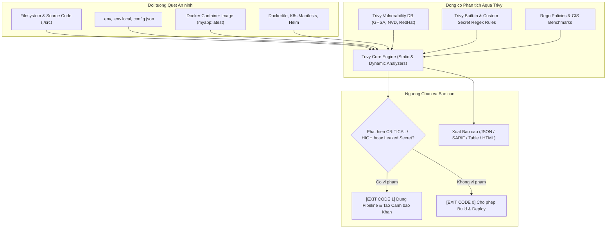

# HUONG DAN CAU HINH TRIVY QUET LO HONG FILESYSTEM, OS PACKAGES VA SECRETS TRONG .ENV

## 1. Tong quan ve Aqua Security Trivy va Cac Lop Kiem soat An ninh

Trivy la bo cong cu quet bao mat toan dien (All-in-One Security Scanner) danh cho moi truong Cloud Native va DevSecOps. Trivy co kha nang phat hien da tang cac rui ro bao mat bao gom:
- **OS Package Vulnerabilities**: Lo hong trong cac goi cai dat he dieu hanh base image (Alpine, Debian, Ubuntu, RedHat).
- **Application Dependencies**: Lo hong trong cac goi phu thuoc phan mem (npm, yarn, pip, go.mod, maven).
- **Hardcoded Secrets & API Keys**: Phat hien cac khoa bi mat, token, private key, mat khau co dinh bi lo lot trong tap tin ma nguon va tap tin `.env`.
- **Infrastructure as Code (IaC) Misconfigurations**: Phat hien cau hinh sai trong Dockerfile, Kubernetes YAML, Terraform.

### So do Cac Lop Kiem soat An ninh cua Trivy (Mermaid)



### So do Luong Quet Filesystem va Secrets (ASCII Diagram)

```
+-----------------------------------------------------------------------+
|                    TRIVY DEVSECOPS SCAN WORKFLOW                      |
|                                                                       |
|   +-----------------------+            +--------------------------+   |
|   |  Filesystem & Code    |            |  Environment Files       |   |
|   |  - package-lock.json  |            |  - .env / .env.local     |   |
|   |  - node_modules       |            |  - config/secrets.yaml   |   |
|   +-----------------------+            +--------------------------+   |
|               |                                     |                 |
|               +------------------+------------------+                 |
|                                  |                                    |
|                                  v                                    |
|                   +-------------------------------+                   |
|                   |   Trivy Scanner Execution     |                   |
|                   |   - trivy fs --security-checks|                   |
|                   |     vuln,secret,config        |                   |
|                   +-------------------------------+                   |
|                                  |                                    |
|                                  v                                    |
|                   +-------------------------------+                   |
|                   |  Trivy Ignore Whitelist Match |                   |
|                   |  - .trivyignore               |                   |
|                   +-------------------------------+                   |
|                                  |                                    |
|                  +---------------+---------------+                    |
|                  |                               |                    |
|                  v (Secrets / CRITICAL Found)    v (Clean / Non-block)|
|      +-----------------------+       +-----------------------+        |
|      | [SECURITY BLOCK]      |       | [SECURITY PASSED]     |        |
|      | Exit Code = 1         |       | Exit Code = 0         |        |
|      | Print Redacted Leaks  |       | Export SARIF/JSON     |        |
|      | Fail Pipeline Build   |       | Proceed to Container  |        |
|      +-----------------------+       +-----------------------+        |
+-----------------------------------------------------------------------+
```

---

## 2. Huong dan Cai dat Trivy CLI

### Cai dat tren Linux (Debian / Ubuntu)

```bash
sudo apt-get install -y wget apt-transport-https gnupg lsb-release
wget -qO - https://aquasecurity.github.io/trivy-repo/deb/public.key | gpg --dearmor | sudo tee /usr/share/keyrings/trivy.gpg > /dev/null
echo "deb [signed-by=/usr/share/keyrings/trivy.gpg] https://aquasecurity.github.io/trivy-repo/deb $(lsb_release -sc) main" | sudo tee -a /etc/apt/sources.list.d/trivy.list
sudo apt-get update
sudo apt-get install -y trivy
```

### Cai dat tren macOS

```bash
brew install aquasecurity/trivy/trivy
```

### Cai dat tren Windows (PowerShell / Scoop / Choco)

```powershell
# Cai qua Scoop
scoop bucket add aquasecurity https://github.com/aquasecurity/scoop-bucket.git
scoop install trivy

# Hoac qua Choco
choco install trivy
```

### Su dung qua Docker Container (Khong can cai dat he thong)

```bash
docker run --rm -v /var/run/docker.sock:/var/run/docker.sock -v $(pwd):/work -w /work aquasec/trivy:latest fs .
```

---

## 3. Cau hinh Quet Filesystem va Phat hien Secrets trong `.env`

Trivy co engine quet Secret rat manh me su dung he thong quy tac regex ket hop danh gia Entropy de phat hien AWS Keys, GitHub PAT, JWT Secrets, Database Passwords, Private Keys bi hardcode.

### Lenh quet toan dien Filesystem (Lỗ hổng + Bí mật + Sai cấu hình)

```bash
trivy fs \
  --scanners vuln,secret,config \
  --severity CRITICAL,HIGH \
  --exit-code 1 \
  --format table \
  .
```

### Lenh chuyen biet quet Secret va khoa bi mat

```bash
trivy fs \
  --scanners secret \
  --exit-code 1 \
  --format table \
  .
```

Vi du ket qua khi phat hien secret bi lo trong file `.env`:

```
+------------------+---------------------+-------------------+--------------------------------+
|     Category     |       Rule ID       |     Severity      |             Target             |
+------------------+---------------------+-------------------+--------------------------------+
| Secret           | generic-api-key     | HIGH              | .env.local:12                  |
| Secret           | jwt-secret-key      | CRITICAL          | src/config/jwt.ts:8            |
+------------------+---------------------+-------------------+--------------------------------+
```

---

## 4. Cau hinh Quet Container Image va OS Packages

Sau khi dong goi Docker Image, Trivy kiem tra toan bo OS base image va thu vien da cai dat:

```bash
# Quet container image cuc bo voi nguong chan CRITICAL
IMAGE_NAME="registry.company.internal/production/core-workflow-engine:1.0.0"

trivy image \
  --severity CRITICAL,HIGH \
  --ignore-unfixed \
  --exit-code 1 \
  --format table \
  "${IMAGE_NAME}"
```

Tham so `--ignore-unfixed` giup bo qua cac lo hong ma nha phat trien goi OS chua co ban va (patch), tap trung vao cac lo hong co the khac phuc ngay bang cach update package.

---

## 5. Thiet lap Tap tin Cau hinh `trivy.yaml` va `.trivyignore`

De dong nhat cau hinh quet tren moi truong Dev va CI Runner, tao tap tin `trivy.yaml` tai goc thu muc du an:

```yaml
# Tap tin cau hinh chuan Trivy Scanner
scan:
  scanners:
    - vuln
    - secret
    - config
  file-patterns:
    - "npm:package-lock.json"
    - "yarn:yarn.lock"

severity:
  - HIGH
  - CRITICAL

exit-code: 1

format: table

vulnerability:
  type:
    - os
    - library
  ignore-unfixed: true

secret:
  enable-builtin: true
  rules:
    - id: custom-internal-company-token
      category: CustomSecret
      title: Internal Company Service Token
      severity: CRITICAL
      regex: 'CPY_TOKEN_[A-Za-z0-9]{32}'

ignorefile: ".trivyignore"
```

### Thiet lap Tap tin `.trivyignore`

Tao tap tin `.trivyignore` de bo qua cac CVE da duoc kiem duyet hoac cac tap tin mau (mock/test):

```
# Bo qua CVE da duoc xac nhan khong the khai thac
CVE-2023-45853

# Bo qua secret gia lap trong test suite
src/tests/fixtures/mock-secrets.json
src/tests/auth.test.ts:34

# Bo qua thu vien dev tools cuc bo
CVE-2023-32681
```

---

## 6. Tich hop Trivy Scanner vao CI/CD Pipeline

Them Stage Trivy Security Scan vao `Jenkinsfile` hoac script CI:

```groovy
stage('Trivy Security Scanning') {
    steps {
        echo "[INFO] Thuc thi Trivy Scan cho Filesystem va Secrets..."
        sh '''
            # 1. Quet Filesystem va Secrets trong ma nguon
            trivy fs \
                --config trivy.yaml \
                --output reports/trivy-fs-report.json \
                --format json \
                .

            # 2. In ket qua dang bang ra console
            trivy fs \
                --config trivy.yaml \
                --format table \
                .
        '''
    }
    post {
        always {
            archiveArtifacts artifacts: 'reports/trivy-fs-report.json', allowEmptyArchive: true
        }
        failure {
            echo "[SECURITY BREACH] Trivy phat hien Lo hong CRITICAL hoac Ro ri Secrets! Build bi huy bo."
        }
    }
}

stage('Trivy Container Image Scan') {
    when {
        branch 'main'
    }
    steps {
        echo "[INFO] Quet bao mat Container Image sau khi build..."
        sh '''
            trivy image \
                --severity CRITICAL,HIGH \
                --ignore-unfixed \
                --exit-code 1 \
                --format table \
                ${DOCKER_REGISTRY}/${PROJECT_NAME}:${IMAGE_TAG}
        '''
    }
}
```

---

## 7. Xuat Bao cao Dinh dang SARIF va Tich hop GitHub Code Scanning

Trivy ho tro xuat ket qua theo tieu chuan **SARIF** (Static Analysis Results Interchange Format) de hien thi truc tiep tren tab **Security -> Code scanning alerts** cua GitHub:

```bash
# Xuat ra file SARIF
trivy fs \
  --format sarif \
  --output trivy-results.sarif \
  .
```

Doi voi GitHub Actions (`.github/workflows/security.yml`):

```yaml
name: Trivy Security Scan
on: [push, pull_request]

jobs:
  trivy-scan:
    name: Run Trivy Scanner
    runs-on: ubuntu-latest
    steps:
      - name: Checkout Code
        uses: actions/checkout@v4

      - name: Run Trivy vulnerability scanner
        uses: aquasecurity/trivy-action@master
        with:
          scan-type: 'fs'
          ignore-unfixed: true
          format: 'sarif'
          output: 'trivy-results.sarif'
          severity: 'CRITICAL,HIGH'

      - name: Upload Trivy scan results to GitHub Security tab
        uses: github/codeql-action/upload-sarif@v3
        with:
          sarif_file: 'trivy-results.sarif'
```

---

## 8. Xu ly Su co Thuong gap (Troubleshooting)

### Su co 1: DB download error / timeout khi chay lan dau
- **Nguyen nhan**: Trivy can tai co so du lieu lo hong `trivy-db` tu GitHub Container Registry (ghcr.io). Neu mang bi chan hoac cham se gay timeout.
- **Khac phuc**: Su dung proxy hoac download truoc db vao thu muc cache:
  ```bash
  trivy image --download-db-only
  ```

### Su co 2: Trivy bat nham bien gia lap trong file `.env.example`
- **Nguyen nhan**: Tap tin vi du `.env.example` co chua chuoi `YOUR_SECRET_KEY_HERE` bi nhan dien la secret pattern.
- **Khac phuc**: Them file `.env.example` vao danh sach loai tru hoac ghi vao `.trivyignore`.

---
*Tai lieu duoc bien soan boi Docs & Knowledge Author Squad.*
