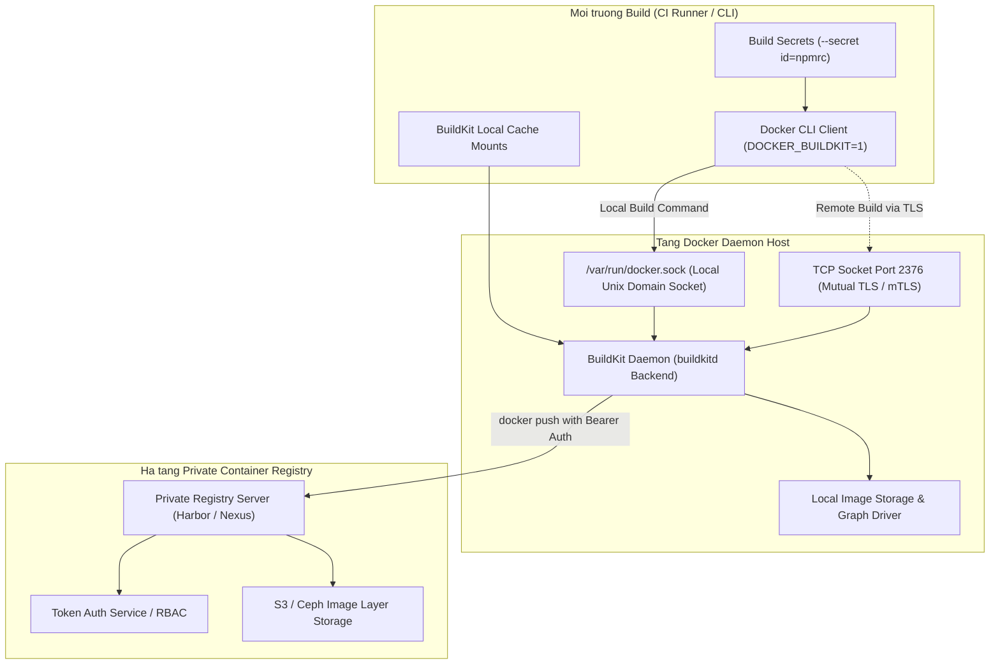

# HUONG DAN KET NOI DOCKER DAEMON SOCKET VA PRIVATE CONTAINER REGISTRY

## 1. Tong quan ve Docker Daemon, BuildKit Engine va Private Registry

Docker BuildKit la the he engine build tiep theo cua Docker giup toi uu hoa toc do bien dich nho co che thuc thi song song cac build stage doc lap, quan ly bo dem cache nang cao (Cache Mounts, Multi-platform builds) va xu ly secret an toan ma khong de lai dau vet trong Image layers.

De dam bao he thong CI/CD hoat dong an toan va hieu qua, viec ket noi toi Docker Daemon thong qua Unix Socket cuc bo hoac TCP Socket bao mat bang TLS/mTLS, dong thoi xac thuc day/keo Image tu Private Container Registry (Harbor, GitHub Container Registry, AWS ECR) la yeu cau cot loi.

### So do Kien truc BuildKit va Private Registry (Mermaid)



### So do Luong Xac thuc va BuildKit Pipeline (ASCII Diagram)

```
+-----------------------------------------------------------------------+
|                    DOCKER BUILDKIT & REGISTRY PIPELINE                |
|                                                                       |
|   +-----------------------+            +--------------------------+   |
|   |  Multi-stage          |            |  Build-time Secrets      |   |
|   |  Dockerfile           |            |  (id=npm_token,src=.env) |   |
|   +-----------------------+            +--------------------------+   |
|               |                                     |                 |
|               +------------------+------------------+                 |
|                                  |                                    |
|                                  v                                    |
|                   +-------------------------------+                   |
|                   |   Docker CLI with BuildKit    |                   |
|                   |   DOCKER_BUILDKIT=1           |                   |
|                   +-------------------------------+                   |
|                                  |                                    |
|                [ /var/run/docker.sock or TLS:2376 ]                   |
|                                  |                                    |
|                                  v                                    |
|                   +-------------------------------+                   |
|                   |   BuildKit Parallel Engine    |                   |
|                   |   - Cache Mount: /root/.npm   |                   |
|                   |   - Target Stage Isolation    |                   |
|                   +-------------------------------+                   |
|                                  |                                    |
|                                  v                                    |
|                   +-------------------------------+                   |
|                   |   Docker Login Auth Handshake |                   |
|                   |   (~/.docker/config.json)     |                   |
|                   +-------------------------------+                   |
|                                  |                                    |
|                                  v                                    |
|                   +-------------------------------+                   |
|                   |   Private Container Registry  |                   |
|                   |   registry.company.internal   |                   |
|                   +-------------------------------+                   |
+-----------------------------------------------------------------------+
```

---

## 2. Kich hoat va Cau hinh Docker BuildKit

### Buoc 2.1: Cau hinh `daemon.json` tren Docker Host

Chinh sua tap tin `/etc/docker/daemon.json` (tren Linux) hoac `C:\ProgramData\docker\config\daemon.json` (tren Windows Server):

```json
{
  "features": {
    "buildkit": true
  },
  "builder": {
    "gc": {
      "enabled": true,
      "defaultKeepStorage": "20GB"
    }
  },
  "log-driver": "json-file",
  "log-opts": {
    "max-size": "50m",
    "max-file": "3"
  },
  "insecure-registries": [
    "registry.internal.company.com:5000"
  ],
  "max-concurrent-downloads": 10,
  "max-concurrent-uploads": 5
}
```

Khoi dong lai Docker Daemon de ap dung cau hinh:

```bash
sudo systemctl daemon-reload
sudo systemctl restart docker
```

### Buoc 2.2: Kich hoat BuildKit tai Terminal hoac CI Script

Khai bao bien moi truong truoc khi thuc thi lenh build:

```bash
export DOCKER_BUILDKIT=1
export COMPOSE_DOCKER_CLI_BUILD=1
```

---

## 3. Cau hinh Ket noi Docker Daemon Socket An toan (mTLS TCP)

Khi can cho phep cac CI Runner tu xa goi Docker Daemon ma khong can cap quyen truy cap truc tiep vao host:

### Buoc 3.1: Tao Chung chi TLS (CA, Server Cert, Client Cert)

```bash
mkdir -p /etc/docker/certs && cd /etc/docker/certs

# 1. Tao CA Key va Certificate
openssl genrsa -aes256 -out ca-key.pem -passout pass:SecureCAPassword2026 4096
openssl req -new -x509 -days 365 -key ca-key.pem -sha256 -out ca.pem \
  -passin pass:SecureCAPassword2026 -subj "/CN=Docker-Root-CA"

# 2. Tao Server Key va Certificate
openssl genrsa -out server-key.pem 4096
openssl req -subj "/CN=docker-host.internal.company.com" -sha256 -new -key server-key.pem -out server.csr
echo subjectAltName = DNS:docker-host.internal.company.com,IP:192.168.1.100,IP:127.0.0.1 >> extfile.cnf
echo extendedKeyUsage = serverAuth >> extfile.cnf
openssl x509 -req -days 365 -sha256 -in server.csr -CA ca.pem -CAkey ca-key.pem \
  -passin pass:SecureCAPassword2026 -CAcreateserial -out server-cert.pem -extfile extfile.cnf

# 3. Tao Client Key va Certificate
openssl genrsa -out key.pem 4096
openssl req -subj '/CN=client' -new -key key.pem -out client.csr
echo extendedKeyUsage = clientAuth > extfile-client.cnf
openssl x509 -req -days 365 -sha256 -in client.csr -CA ca.pem -CAkey ca-key.pem \
  -passin pass:SecureCAPassword2026 -CAcreateserial -out cert.pem -extfile extfile-client.cnf

# Phan quyen tap tin
chmod 0400 ca-key.pem key.pem server-key.pem
chmod 0444 ca.pem server-cert.pem cert.pem
```

### Buoc 3.2: Cau hinh Docker Daemon lang nghe qua TLS Port 2376

Cap nhat `/etc/docker/daemon.json`:

```json
{
  "hosts": ["fd://", "tcp://0.0.0.0:2376"],
  "tls": true,
  "tlsverify": true,
  "tlscacert": "/etc/docker/certs/ca.pem",
  "tlscert": "/etc/docker/certs/server-cert.pem",
  "tlskey": "/etc/docker/certs/server-key.pem"
}
```

### Buoc 3.3: Ket noi tu Client tu xa

```bash
export DOCKER_HOST="tcp://docker-host.internal.company.com:2376"
export DOCKER_TLS_VERIFY=1
export DOCKER_CERT_PATH="/path/to/client-certs"

# Kiem tra ket noi an toan
docker version
```

---

## 4. Huong dan Dang ky va Xac thuc Private Container Registry

### Buoc 4.1: Dang nhap Private Registry tu Terminal

```bash
REGISTRY_URL="registry.company.internal"
REGISTRY_USER="ci-deployer"
REGISTRY_TOKEN="hb_secret_token_xxxxxxxxxxxx"

# Dang nhap an toan qua STDIN (khong lo password trong bash history)
echo "${REGISTRY_TOKEN}" | docker login "${REGISTRY_URL}" -u "${REGISTRY_USER}" --password-stdin
```

Tap tin `~/.docker/config.json` se tu dong duoc tao hoac cap nhat:

```json
{
  "auths": {
    "registry.company.internal": {
      "auth": "Y2ktZGVwbG95ZXI6aGJfc2VjcmV0X3Rva2VuX3h4eHh4eHh4eHh4"
    }
  },
  "HttpHeaders": {
    "User-Agent": "Docker-Client/24.0.5"
  }
}
```

### Buoc 4.2: Cau hinh Harbor Robot Account

Neu su dung Harbor Registry:
1. Vao Project -> **Robot Accounts** -> **Add Robot Account**.
2. Dat ten: `robot-ci-builder`.
3. Phan quyen: `Push Artifact`, `Pull Artifact`.
4. Sao chep chuoi Secret Token duoc sinh ra va them vao Jenkins Credentials / Secret Store.

---

## 5. Mau Multi-stage Dockerfile Toi uu voi BuildKit Cache va Secret Mount

Tao tap tin `Dockerfile` tai goc du an de tan dung suc manh cua BuildKit:

```dockerfile
# syntax=docker/dockerfile:1.4

# ==============================================================================
# STAGE 1: Dependency Base & Package Cache
# ==============================================================================
FROM node:18-alpine AS deps
WORKDIR /app

# Cai dat libc6-compat de tuong thich thu vien C native tren Alpine
RUN apk add --no-cache libc6-compat

COPY package.json package-lock.json ./

# Su dung BuildKit Cache Mount de luu thu muc npm cache giua cac lan build
RUN --mount=type=cache,target=/root/.npm \
    npm ci --prefer-offline --no-audit

# ==============================================================================
# STAGE 2: Source Compilation & Asset Bundling
# ==============================================================================
FROM node:18-alpine AS builder
WORKDIR /app

COPY --from=deps /app/node_modules ./node_modules
COPY . .

# Su dung Secret Mount de doc cac khoa bao mat trong qua trinh build ma khong luu vao Image
# RUN --mount=type=secret,id=build_secrets,target=/app/.env \
#     npm run build

ENV NEXT_TELEMETRY_DISABLED=1
ENV NODE_ENV=production

RUN npm run build

# ==============================================================================
# STAGE 3: Production Minimal Runtime
# ==============================================================================
FROM node:18-alpine AS runner
WORKDIR /app

ENV NODE_ENV=production
ENV PORT=3000
ENV HOSTNAME="0.0.0.0"

# Tao non-root user de tang cuong an ninh
RUN addgroup --system --gid 1001 nodejs && \
    adduser --system --uid 1001 nextjs

# Chi sao chep cac artifact can thiet nhat
COPY --from=builder /app/public ./public
COPY --from=builder --chown=nextjs:nodejs /app/.next/standalone ./
COPY --from=builder --chown=nextjs:nodejs /app/.next/static ./.next/static

USER nextjs

EXPOSE 3000

HEALTHCHECK --interval=30s --timeout=3s --start-period=5s --retries=3 \
  CMD wget --no-verbose --tries=1 --spider http://localhost:3000/api/health || exit 1

CMD ["node", "server.js"]
```

---

## 6. Thuc thi Build, Tag va Push Image

Lenh build voi day du tham so toi uu hoa:

```bash
REGISTRY="registry.company.internal/production"
IMAGE_NAME="core-workflow-engine"
TAG="v1.0.0"

# Thuc thi build voi BuildKit
DOCKER_BUILDKIT=1 docker build \
  --file Dockerfile \
  --tag "${REGISTRY}/${IMAGE_NAME}:${TAG}" \
  --tag "${REGISTRY}/${IMAGE_NAME}:latest" \
  --build-arg BUILD_TIME="$(date -u +'%Y-%m-%dT%H:%M:%SZ')" \
  .

# Day image len Private Registry
docker push "${REGISTRY}/${IMAGE_NAME}:${TAG}"
docker push "${REGISTRY}/${IMAGE_NAME}:latest"
```

---

## 7. Quan ly Build Cache va Garbage Collection

Kiem tra va don dep cache BuildKit de tiet kiem dung luong o dia:

```bash
# Xem dung luong cache dang chiem dung
docker buildx du

# Don dep toan bo build cache khong su dung qua 48h
docker buildx prune --force --filter until=48h

# Don dep toan bo cache
docker builder prune -a --force
```

---

## 8. Xu ly Su co Thuong gap (Troubleshooting)

### Su co 1: `x509: certificate signed by unknown authority` khi push image
- **Nguyen nhan**: Private Registry su dung SSL Self-Signed hoac Internal CA chua duoc OS tin tuong.
- **Khac phuc**: Sao chep file `ca.crt` cua Registry vao `/etc/docker/certs.d/registry.company.internal/ca.crt` tren may chu Docker Host.

### Su co 2: `failed to solve with frontend dockerfile.v0`
- **Nguyen nhan**: Cu phap Dockerfile cu khong tuong thich hoac docker version khong ho tro BuildKit frontend.
- **Khac phuc**: Them dong dau tien vao Dockerfile: `# syntax=docker/dockerfile:1.4` va dam bao da dat `export DOCKER_BUILDKIT=1`.

---
*Tai lieu duoc bien soan boi Docs & Knowledge Author Squad.*
