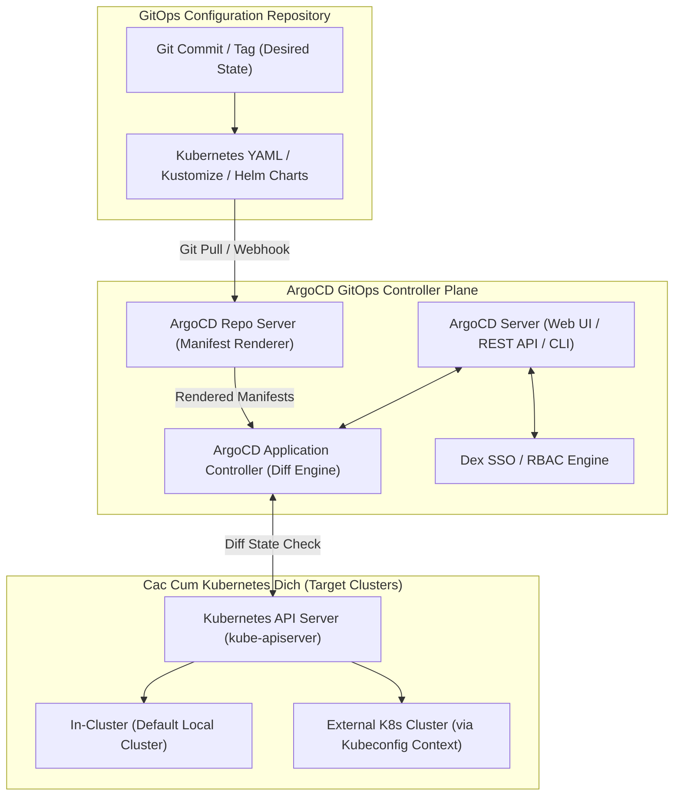

# HUONG DAN CAU HINH ARGOCD GITOPS CONTROLLER VA NAP FILE KUBECONFIG CUM K8S

## 1. Tong quan Nguyen ly Van hanh GitOps va Kien truc ArgoCD

GitOps la mo hinh van hanh he thong dua tren nguyen ly su dung Git lam Nguon Chan Ly Duy Nhat (Single Source of Truth) cho toan bo trang thai mong muon (Desired State) cua ha tang va ung dung Kubernetes.

ArgoCD la GitOps Continuous Delivery Controller hoat dong ben trong Kubernetes. ArgoCD lien tuc so sanh trang thai khai bao tren Git Repository voi trang thai thuc te dang chay tren cum Kubernetes (Actual State). Khi co su sai lech (OutOfSync), ArgoCD tu dong hoac cho phep nguoi van hanh dong bo hoa (Sync) de dua ung dung ve trang thai dung chuan, dong thoi tu sua loi (Self-Heal) neu co ai do sua truc tiep tren cum bang tay.

### So do Kien truc ArgoCD va Cum Kubernetes (Mermaid)



### So do Luong Dong bo GitOps tu Git toi K8s (ASCII Diagram)

```
+-----------------------------------------------------------------------+
|                    GITOPS CONTINUOUS DELIVERY FLOW                    |
|                                                                       |
|   +-----------------------+            +--------------------------+   |
|   |  GitOps Repository    |            |  Developer / CI System   |   |
|   |  (Desired State YAML) | <--------- |  (Updates image tag)     |   |
|   +-----------------------+            +--------------------------+   |
|               |                                                       |
|               | (Git Webhook / 3-minute poll)                         |
|               v                                                       |
|   +---------------------------------------------------------------+   |
|   |                    ArgoCD Controller Plane                    |   |
|   |                                                               |   |
|   |   +-------------------+              +--------------------+   |   |
|   |   | Repo Server       |              | Application        |   |   |
|   |   | (Helm / Kustomize)| -----------> | Controller         |   |   |
|   |   +-------------------+              +--------------------+   |   |
|   |                                                |              |   |
|   +------------------------------------------------|--------------+   |
|                                                    |                  |
|                           [ Diff Engine Check ]    |                  |
|                                                    v                  |
|                  +---------------------------------+                  |
|                  |                                 |                  |
|                  v (OutOfSync detected)            v (InSync)         |
|      +-----------------------+             +-----------------------+  |
|      | Automated Sync        |             | Green State           |  |
|      | - Apply Manifests     |             | No action needed      |  |
|      | - Self-Heal drift     |             | Healthy Cluster       |  |
|      +-----------------------+             +-----------------------+  |
|                  |                                                    |
|                  v                                                    |
|   +---------------------------------------------------------------+   |
|   |               Target Kubernetes Cluster (Kubeconfig)           |   |
|   |   - Deployments, Services, Ingress, ConfigMaps, Secrets       |   |
|   +---------------------------------------------------------------+   |
+-----------------------------------------------------------------------+
```

---

## 2. Huong dan Cai dat ArgoCD tren Kubernetes Cluster

### Buoc 2.1: Tao Namespace va Cai dat Manifests

```bash
# 1. Tao namespace chuyen biet cho ArgoCD
kubectl create namespace argocd

# 2. Cai dat ArgoCD ban on dinh moi nhat
kubectl apply -n argocd -f https://raw.githubusercontent.com/argoproj/argo-cd/stable/manifests/install.yaml

# 3. Kiem tra trang thai cac Pods
kubectl get pods -n argocd -w
```

### Buoc 2.2: Cau hinh Service sang NodePort hoac Ingress

Chuyen doi Service `argocd-server` sang `NodePort` de truy cap Web UI:

```bash
kubectl patch svc argocd-server -n argocd -p '{"spec": {"type": "NodePort"}}'

# Hoac expose port cuc bo qua Port-Forward
kubectl port-forward svc/argocd-server -n argocd 8080:443
```

### Buoc 2.3: Lay mat khau ban dau cua tai khoan Admin

```bash
# Lay Initial Admin Password
kubectl -n argocd get secret argocd-initial-admin-secret -o jsonpath="{.data.password}" | base64 -d
echo ""
```

---

## 3. Huong dan Dang nhap va Thao tac qua ArgoCD CLI

### Buoc 3.1: Cai dat ArgoCD CLI

Tren Linux:
```bash
VERSION=$(curl --silent "https://api.github.com/repos/argoproj/argo-cd/releases/latest" | grep '"tag_name":' | sed -E 's/.*"([^"]+)".*/\1/')
curl -sSL -o argocd-linux-amd64 https://github.com/argoproj/argo-cd/releases/download/$VERSION/argocd-linux-amd64
sudo install -m 555 argocd-linux-amd64 /usr/local/bin/argocd
rm argocd-linux-amd64
```

Tren macOS:
```bash
brew install argocd
```

Tren Windows (PowerShell):
```powershell
choco install argocd-cli
```

### Buoc 3.2: Dang nhap va doi mat khau Admin

```bash
# Dang nhap vao server
argocd login localhost:8080 --username admin --insecure

# Cap nhat mat khau moi
argocd account update-password
```

---

## 4. Nap GitOps Repository vao ArgoCD

### Phuong an 1: Nap Repository qua SSH Private Key

```bash
argocd repo add git@github.com:company/core-gitops-manifests.git \
  --ssh-private-key-path ~/.ssh/id_ed25519 \
  --name "core-gitops-repo"
```

### Phuong an 2: Nap Repository qua HTTPS Personal Access Token (PAT)

```bash
argocd repo add https://github.com/company/core-gitops-manifests.git \
  --username "git-ci-bot" \
  --password "ghp_xxxxxxxxxxxxxxxxxxxxxxxxxxxx" \
  --name "core-gitops-repo"
```

Kiem tra danh sach Repository da ket noi:
```bash
argocd repo list
```

---

## 5. Nap File Kubeconfig va Them Cum Kubernetes Ngoai

Khi ArgoCD Controller dat tai mot Management Cluster va can dieu phoi trien khai toi cac Worker/Production Cluster khac:

### Buoc 5.1: Chuan bi tap tin Kubeconfig cua Cum dich

Dam bao context trong file `kubeconfig` co quyen `cluster-admin` tren cum dich:

```bash
# Kiem tra cac context co trong kubeconfig
kubectl config --kubeconfig=/path/to/prod-kubeconfig.yaml get-contexts
```

### Buoc 5.2: Nap Cum Kubernetes vao ArgoCD bang CLI

```bash
# Them cluster bang context name
KUBECONFIG=/path/to/prod-kubeconfig.yaml argocd cluster add prod-k8s-cluster \
  --name "production-cluster-asia" \
  --in-cluster=false \
  --yes
```

### Buoc 5.3: Kiem tra danh sach Cluster

```bash
argocd cluster list
```

Ket qua hien thi:
```
SERVER                          NAME                       STATUS      MESSAGE
https://kubernetes.default.svc  in-cluster                 Successful  
https://10.200.0.1:6443         production-cluster-asia    Successful  
```

---

## 6. Dinh nghia Application Manifest (CRD) Mau

Tao tap tin `application-core-engine.yaml` de khai bao ung dung GitOps:

```yaml
apiVersion: argoproj.io/v1alpha1
kind: Application
metadata:
  name: core-workflow-engine-prod
  namespace: argocd
  finalizers:
    - resources-finalizer.argocd.argoproj.io
spec:
  project: default
  source:
    repoURL: 'git@github.com:company/core-gitops-manifests.git'
    targetRevision: main
    path: environments/production
  destination:
    server: 'https://10.200.0.1:6443' # Dia chi K8s API Server dich
    namespace: workflow-production
  syncPolicy:
    automated:
      prune: true     # Tu dong xoa cac resource khong con ton tai trong Git
      selfHeal: true  # Tu dong ghi de lai neu ai do sua tay truc tiep tren cluster
      allowEmpty: false
    syncOptions:
      - CreateNamespace=true
      - ApplyOutOfSyncOnly=true
      - PruneLast=true
    retry:
      limit: 5
      backoff:
        duration: 5s
        factor: 2
        maxDuration: 3m
```

Ap dung manifest de khoi tao Application:

```bash
kubectl apply -f application-core-engine.yaml
```

---

## 7. Thao tac Dong bo va Kiem tra Trang thai

```bash
# Xem trang thai chi tiet cua App
argocd app get core-workflow-engine-prod

# Thuc hien Manual Sync
argocd app sync core-workflow-engine-prod

# Xem lich su cac lan Sync
argocd app history core-workflow-engine-prod

# Rollback ve revision truoc neu co su co
argocd app rollback core-workflow-engine-prod 3
```

---

## 8. Xu ly Su co Thuong gap (Troubleshooting)

### Su co 1: `ComparisonError: rpc error: code = Unknown desc = error testing repository connectivity`
- **Nguyen nhan**: SSH Key hoac Token sai, hoac ArgoCD Server khong the truy cap Internet/Git Server do Firewall.
- **Khac phuc**: Kiem tra lai secret trong `argocd-secret` va phan quyen SSH Key tren Git Server.

### Su co 2: Ung dung roi vao trang thai `OutOfSync` lien tuc (Self-Heal Loop)
- **Nguyen nhan**: Mot so truong duoc Kubernetes tu dong them (vi du `status`, default admission webhooks, horizontalPodAutoscaler thay doi replica) gay lech diff voi Git.
- **Khac phuc**: Su dung `ignoreDifferences` trong Application spec de bo qua cac truong tu dong sinh:
  ```yaml
  spec:
    ignoreDifferences:
      - group: apps
        kind: Deployment
        jsonPointers:
          - /spec/replicas
  ```

---
*Tai lieu duoc bien soan boi Docs & Knowledge Author Squad.*
