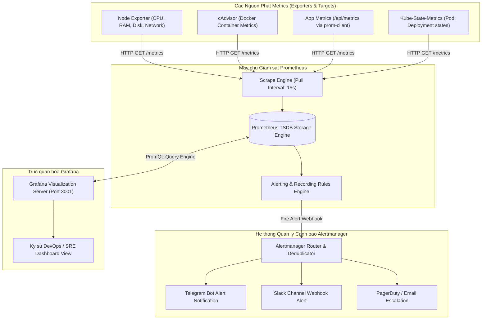

# HUONG DAN CAU HINH SCRAPE TARGETS PROMETHEUS, GRAFANA DASHBOARD VA ALERTMANAGER

## 1. Tong quan ve He sinh thai Giam sat Prometheus, Grafana va Alertmanager

He thong quan sat (Observability) va giam sat hieu nang (Monitoring) toan dien la thanh phan khong the thieu trong ha tang hien dai. Bo ba cong cu Prometheus, Grafana va Alertmanager cung cap giai phap:
- **Prometheus Server**: Thu thap (Scrape) du lieu chi so (Metrics) theo dinh ky thong qua giao thuc HTTP (Pull Model), luu tru du lieu chuoi thoi gian (Time Series Database - TSDB) va danh gia quy tac canh bao (PromQL Alert Rules).
- **Grafana Dashboard**: Truc quan hoa cac chi so he thong duoi dang bieu do, dong ho, bang so lieu thoi gian thuc voi kha nang tuy bien cao.
- **Alertmanager**: Tiep nhan canh bao tu Prometheus, thuc hien gom nhom (Grouping), loai bo trung lap (Deduplicating), tat tam thoi (Silencing) va dinh tuyen gui thong bao toi cac kenh nhu Telegram, Slack, Webhook hoac Email.

### So do Kien truc He thong Giam sat (Mermaid)



### So do Luong Canh bao va Truc quan hoa (ASCII Diagram)

```
+-----------------------------------------------------------------------+
|                    PROMETHEUS & GRAFANA OBSERVABILITY                 |
|                                                                       |
|   +-----------------------+            +--------------------------+   |
|   |  Node Exporter :9100  |            |  App Metrics :3000       |   |
|   |  (OS Host Metrics)    |            |  (Next.js / Node Server) |   |
|   +-----------------------+            +--------------------------+   |
|               |                                     |                 |
|               | (Scrape every 15s)                  |                 |
|               v                                     v                 |
|   +---------------------------------------------------------------+   |
|   |                      PROMETHEUS SERVER                        |   |
|   |   - TSDB Storage Engine                                       |   |
|   |   - Alert Rules: node_cpu_utilization > 85%                   |   |
|   |   - Alert Rules: up == 0 (Service Down)                       |   |
|   +---------------------------------------------------------------+   |
|               |                                     |                 |
|               | (PromQL Queries)                    | (Alert Trigger) |
|               v                                     v                 |
|   +-----------------------+            +--------------------------+   |
|   |  Grafana UI :3001     |            |  Alertmanager :9093      |   |
|   |  - Cluster Dashboards |            |  - Telegram Dispatcher   |   |
|   |  - Realtime Charts    |            |  - Slack Notification    |   |
|   +-----------------------+            +--------------------------+   |
+-----------------------------------------------------------------------+
```

---

## 2. Trien khai Cum Prometheus, Grafana va Alertmanager bang Docker Compose

### Buoc 2.1: Chuan bi tap tin `docker-compose.yml`

```yaml
version: '3.8'

networks:
  monitoring:
    driver: bridge

volumes:
  prometheus_data:
  grafana_data:
  alertmanager_data:

services:
  prometheus:
    image: prom/prometheus:v2.48.0
    container_name: monitoring-prometheus
    restart: unless-stopped
    ports:
      - "9090:9090"
    volumes:
      - ./prometheus.yml:/etc/prometheus/prometheus.yml:ro
      - ./alert.rules.yml:/etc/prometheus/alert.rules.yml:ro
      - prometheus_data:/prometheus
    command:
      - '--config.file=/etc/prometheus/prometheus.yml'
      - '--storage.tsdb.path=/prometheus'
      - '--web.console.libraries=/usr/share/prometheus/console_libraries'
      - '--web.console.templates=/usr/share/prometheus/consoles'
      - '--storage.tsdb.retention.time=30d'
      - '--web.enable-lifecycle'
    networks:
      - monitoring

  alertmanager:
    image: prom/alertmanager:v0.26.0
    container_name: monitoring-alertmanager
    restart: unless-stopped
    ports:
      - "9093:9093"
    volumes:
      - ./alertmanager.yml:/etc/alertmanager/alertmanager.yml:ro
      - alertmanager_data:/alertmanager
    command:
      - '--config.file=/etc/alertmanager/alertmanager.yml'
      - '--storage.path=/alertmanager'
    networks:
      - monitoring

  grafana:
    image: grafana/grafana:10.2.0
    container_name: monitoring-grafana
    restart: unless-stopped
    ports:
      - "3001:3000"
    environment:
      - GF_SECURITY_ADMIN_USER=admin
      - GF_SECURITY_ADMIN_PASSWORD=GrafanaAdminSecure2026
      - GF_USERS_ALLOW_SIGN_UP=false
    volumes:
      - grafana_data:/var/lib/grafana
    networks:
      - monitoring

  node-exporter:
    image: prom/node-exporter:v1.7.0
    container_name: monitoring-node-exporter
    restart: unless-stopped
    ports:
      - "9100:9100"
    volumes:
      - /proc:/host/proc:ro
      - /sys:/host/sys:ro
      - /:/rootfs:ro
    command:
      - '--path.procfs=/host/proc'
      - '--path.rootfs=/rootfs'
      - '--path.sysfs=/host/sys'
      - '--collector.filesystem.mount-points-exclude=^/(sys|proc|dev|host|etc)($$|/)'
    networks:
      - monitoring
```

---

## 3. Cau hinh Tap tin `prometheus.yml` (Scrape Targets)

Tao tap tin `prometheus.yml`:

```yaml
global:
  scrape_interval: 15s
  evaluation_interval: 15s
  scrape_timeout: 10s

# Thiet lap ket noi toi Alertmanager
alerting:
  alertmanagers:
    - static_configs:
        - targets:
            - 'alertmanager:9093'

# Tap tin chua cac luat canh bao
rule_files:
  - 'alert.rules.yml'

# Danh sach cac Scrape Targets can thu thap
scrape_configs:
  # 1. Prometheus Server Self-monitoring
  - job_name: 'prometheus'
    static_configs:
      - targets: ['localhost:9090']

  # 2. Host OS Metrics (Node Exporter)
  - job_name: 'node-exporter'
    static_configs:
      - targets: ['node-exporter:9100']
        labels:
          environment: 'production'
          node_role: 'ci-runner-host'

  # 3. Application Metrics (Next.js / Node.js Engine)
  - job_name: 'workflow-app'
    metrics_path: '/api/metrics'
    scrape_interval: 10s
    static_configs:
      - targets: ['host.docker.internal:3000']
        labels:
          app: 'core-workflow-engine'
          tier: 'frontend-backend'
```

---

## 4. Thiet lap Tap tin Luat Canh bao `alert.rules.yml`

Tao tap tin `alert.rules.yml`:

```yaml
groups:
  - name: infrastructure_alerts
    rules:
      # Canh bao khi co service bi Down
      - alert: ServiceEndpointDown
        expr: up == 0
        for: 1m
        labels:
          severity: critical
        annotations:
          summary: "Dich vu {{ $labels.job }} bi ngung hoat dong!"
          description: "Target {{ $labels.instance }} khong the phan hoi scrape request trong hon 1 phut."

      # Canh bao CPU Server cao tren 85%
      - alert: HighCpuUsage
        expr: 100 - (avg by (instance) (rate(node_cpu_seconds_total{mode="idle"}[5m])) * 100) > 85
        for: 5m
        labels:
          severity: warning
        annotations:
          summary: "CPU qua tai tren {{ $labels.instance }}"
          description: "Muc su dung CPU vuot qua 85% trong 5 phut lien tiep (Hien tai: {{ $value }}%)."

      # Canh bao Disk Space sap day (< 15% dung luong con trong)
      - alert: LowDiskSpace
        expr: (node_filesystem_avail_bytes * 100) / node_filesystem_size_bytes < 15
        for: 10m
        labels:
          severity: critical
        annotations:
          summary: "Dung luong o dia sap day tren {{ $labels.instance }}"
          description: "Dung luong con lai duoi 15% tren mountpoint {{ $labels.mountpoint }}."

      # Canh bao Ti le Request Loi HTTP 5xx cao tren ung dung
      - alert: HighHttp5xxRate
        expr: sum(rate(http_requests_total{status=~"5.."}[2m])) / sum(rate(http_requests_total[2m])) * 100 > 5
        for: 2m
        labels:
          severity: critical
        annotations:
          summary: "Ti le HTTP 5xx loi vuot qua 5% tren {{ $labels.app }}"
          description: "Ung dung dang phat sinh nhieu loi Server Internal Error 5xx (Hien tai: {{ $value }}%)."
```

---

## 5. Cau hinh Tap tin `alertmanager.yml` Gui Thong bao Telegram / Webhook

Tao tap tin `alertmanager.yml`:

```yaml
global:
  resolve_timeout: 5m

# Cau truc tuyen thong bao
route:
  group_by: ['alertname', 'cluster', 'service']
  group_wait: 30s
  group_interval: 5m
  repeat_interval: 4h
  receiver: 'telegram-ops-channel'
  routes:
    - match:
        severity: critical
      receiver: 'telegram-ops-channel'
      continue: true
    - match:
        severity: warning
      receiver: 'webhook-logging'

receivers:
  - name: 'telegram-ops-channel'
    telegram_configs:
      - bot_token: '123456789:ABCdefGhIJKlmNoPQRsTUVwxyZ_secret_token'
        chat_id: -1001987654321
        parse_mode: 'HTML'
        send_resolved: true
        message: |
          <b>[ALERT NOTIFICATION]</b>
          <b>Alert:</b> {{ .GroupLabels.alertname }}
          <b>Severity:</b> {{ .CommonLabels.severity }}
          <b>Status:</b> {{ .Status }}
          
          <b>Description:</b> {{ range .Alerts }}{{ .Annotations.description }}
          {{ end }}

  - name: 'webhook-logging'
    webhook_configs:
      - url: 'http://host.docker.internal:3000/api/infra-alerts'
        send_resolved: true
```

---

## 6. Huong dan Ket noi Data Source va Tao Dashboard tren Grafana

### Buoc 6.1: Them Prometheus Data Source vao Grafana
1. Dang nhap vao Grafana tai `http://<server-ip>:3001` (`admin` / `GrafanaAdminSecure2026`).
2. Vao **Connections -> Data sources -> Add data source**.
3. Chon **Prometheus**.
4. Tai muc **Prometheus server URL**, nhap: `http://prometheus:9090`.
5. Nhan **Save & test**. Dam bao xuat hien thong bao xanh: `Successfully queried the Prometheus API.`

### Buoc 6.2: Import Dashboard Node Exporter Chuan (ID: 1860)
1. Vao **Dashboards -> New -> Import**.
2. Nhap Dashboard ID: `1860` (Node Exporter Full) va nhan **Load**.
3. Chon Data Source la **Prometheus** da tao.
4. Nhan **Import**. Ban se co ngay dashboard theo doi chi tiet CPU, Memory, Disk I/O, Network Traffic cua toan bo may chu.

---

## 7. Kiem thu Kich hoat Canh bao (Alert Simulation)

Kiem tra tinh nang Alert bang cach gia lap tai CPU cao hoac ngung dich vu:

```bash
# 1. Thu nghiem ngung Node Exporter de kich hoat ServiceEndpointDown
docker stop monitoring-node-exporter

# 2. Kiem tra tren giao dien Prometheus UI http://localhost:9090/alerts
# Alert se chuyen tu trang thai PENDING -> FIRING sau 1 phut.

# 3. Kiem tra log Alertmanager
docker logs -f monitoring-alertmanager

# 4. Khoi dong lai Node Exporter de kiem tra tinh nang tu dong Resolved
docker start monitoring-node-exporter
```

---

## 8. Xu ly Su co Thuong gap (Troubleshooting)

### Su co 1: Prometheus Target bao `DOWN` (Connection refused)
- **Nguyen nhan**: Target exporter khong chay tren cung Docker network hoac bi tuong lua chan port.
- **Khac phuc**: Dam bao tat ca containers nam trong mang `monitoring`, su dung container_name lam hostname thay vi `localhost`.

### Su co 2: Alertmanager khong gui duoc tin nhan Telegram
- **Nguyen nhan**: `bot_token` hoac `chat_id` sai, hoac bot chua duoc them vao nhom Telegram va cap quyen gui tin nhan.
- **Khac phuc**: Gui thu tin nhan qua curl de test token:
  ```bash
  curl -s -X POST "https://api.telegram.org/bot<TOKEN>/sendMessage" \
    -d "chat_id=<CHAT_ID>&text=Test Alert Message"
  ```

---
*Tai lieu duoc bien soan boi Docs & Knowledge Author Squad.*
